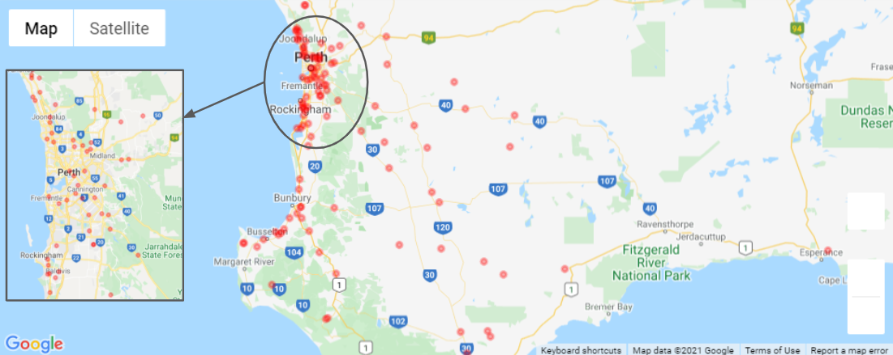

# WA traffic accidents

## Task

In this project, traffic incidents across WA roads are investigated in order to explore whether or not there is a relationship between the number/severity of accidents and the following variables:

* Year of crash
* Time of crash
* Road speed limit
* Vehicle type

For this, Pandas is used to clean and format the datasets and to illustrate the final data analysis. Matplotlib is used to create visualisations of the data. Gmaps (a Jupyter plugin) is employed to visualise fatal crashed across WA roads in 2020.

## Data source

https://catalogue.data.wa.gov.au/dataset/mrwa-crash-information-last-5-years-/resource/0ccf6e57-9f54-4d94-bd21-0be0df989608?inner_span=True

https://catalogue.data.wa.gov.au/dataset/mrwa-legal-speed-limits/resource/1dfeab67-639b-4c59-acda-33d3242ac38d?inner_span=True

## Visualisations 

Below are some examples of visualisations from the dataset obtained using python:

* Traffic incidents per year 

* Traffic incidents per time of the day 

* Suburbs with major fatal accidents

* Accident type distribution (Midblock vs Intersection)

* Road incidents vs speed limit (grouped by severity)

* WA fatal crash map in 2020

* Vulnerable road users

